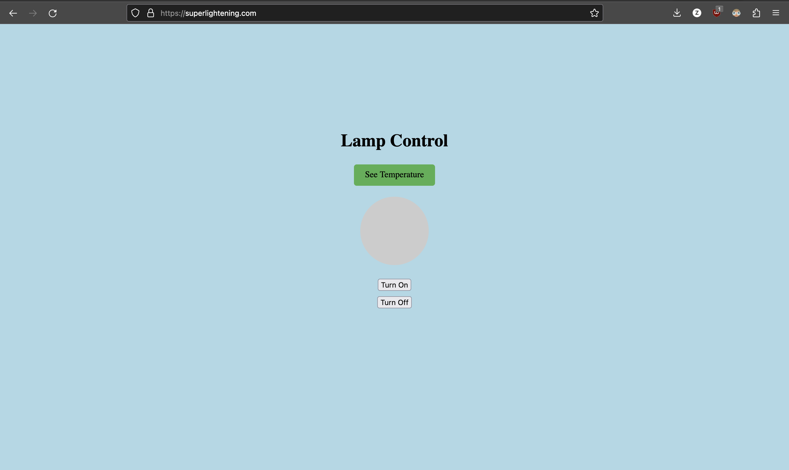

This is a light control that helps you close and open lights. It also helps you save energy use, measuring the temperature and it's also connected with Google Realtime Firebase. 

# Project Materials

## Hardware

- Raspberry Pi 4
- Arduino Uno
- Temperature sensor (DS18B20)
- LED display module
- Jumper wires
- Breadboard
- Resistors

## Software

- Python 3
- Flask framework
- HTML/CSS
- JavaScript
- Arduino IDE

Control the lamp [here](http://superlightening.com/). Using the website you can control the status of the lamp using the turn on and turn off buttons. Then see the temmperature sensor data by clicking the See Temperature button.

